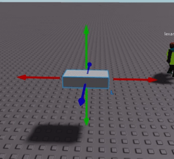
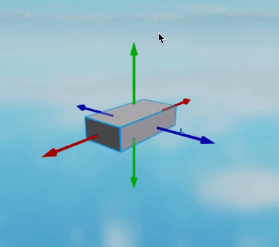
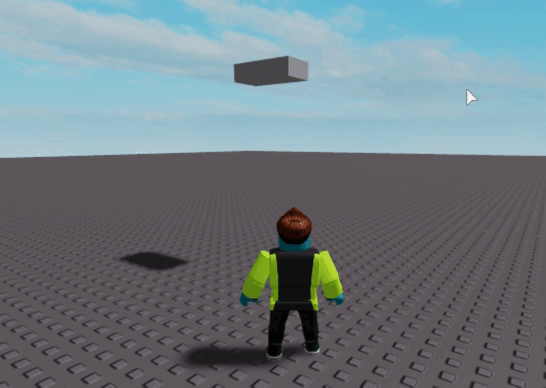
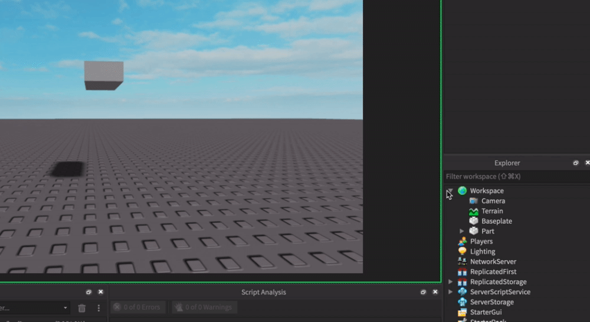
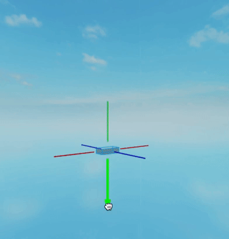
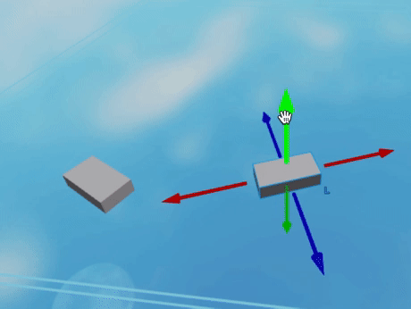
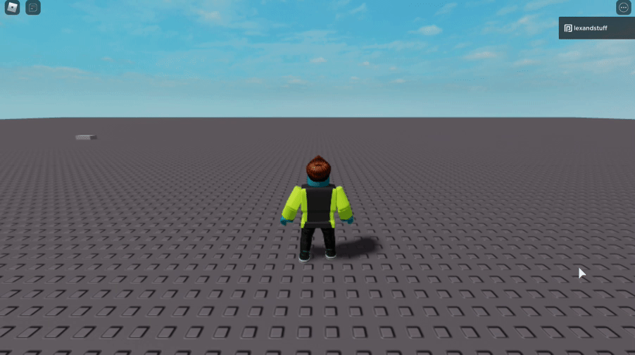

Link: https://developer.roblox.com/en-us/articles/BodyMover
Title: [[BodyMovers]]
Author: [[Roblox]]
Type: #article
Topics: [[roblox]] [[bodymovers]] [[force]]

# BodyMovers

* Notes about studio: X axis is represented as red, Y = green and Z = blue
    * ![[Pasted image 20201227122707.png]]
* Used to move Parts against `gravity` and other forces.
* You cannot apply force to an anchored object.
* BodyMovers objects either have a `Force`, `MaxTorque` or `MaxForce` property that function the same.
    * They are Vector3 properties that define the amount of force on each axis (X, Y, Z).
* `P` amount of power used to reach goal.
    * Higher the P value, the faster it moves towards goal (may even surpass)
* `D` amount of damping
    * Used to stop object from reaching the goal and turning around,
    * By setting a good D, object will slow down before reaching its goal.
* `BodyAngularVelocity`
    * Sets a constant rotational velocity. Will turn a part given other forces aren't acting upon it. Parameters:
    * `AngularVelocity` - a Vector3 which describes the direction the part rotates around and the speed in radians per second.
        * Examples:
            * Rotate around the X-axis at 180 degrees (3.14159 radians) per second.
                * `AngularVector = Vector3.new(3.14159, 0, 0)`
                * 
            * Rotate around the Y-axis at 360 degrees (6.28319 radians) per second.
                *  
* `BodyVelocity`
    * Used to set a constant velocity: move part at constant speed despite gravity.
    * `Velocity` - maximum speed object can go
    * Examples:
        * `BodyVelocity` with `Velocity = Vector3.new(0, 2, 0)`
            * 
* `BodyForce`
    * Push a part using a magnitude and direction in worlds coordinates (regardless of orientation).
    * Commonly used to counteract effects of gravity.
    * Examples:
        * Removing a body force set to counteract effects of gravity  (`BodyForce.Velocity = Vector3.new(0, part:GetMass() * workspace.Gravity, 0)`)
            * 
* `BodyThrust`
    * Similar to `BodyForce` except you can specify the location where the force will be applied, so you can specify a rotational force.
* `BodyPosition`
    * Move a part toward a position ignoring gravity.
    * Examples:
        * Move a part toward `Vector3.new(0, 50, 0)` with `P=10000`
        * 
* `BodyGyro`
    * Used to turn a part to match the rotational velocity of another part.
    * Examples:
        * Simple script that applies a gyro to Part1 (left most) based on CFrame of Part2 (right-most)
        * ```while true do
                local part1 = game.Workspace.Part1 -- The part that will turn to face Part2
                local part2 = game.Workspace.Part2

                part1.BodyGyro.cframe = CFrame.new(part1.Position, part2.Position)
                wait()
            end```
        * 
* `RocketPropulsion`
    * Applies a force on a part so it follows and faces a target.
    * Like a hybrid of `BodyGyro` and `BodyPosition`
    * Used to mimic the effects of a projectile.
    * Examples:
        * Simple script that makes the UpperTorso of my character the target:
        ```
        script.Parent.RocketPropulsion.Target = workspace.lexandstuff.UpperTorso
        script.Parent.RocketPropulsion:Fire()
        ```
        * 
