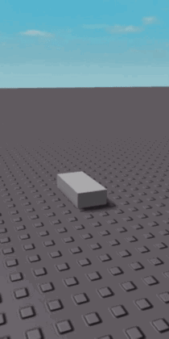
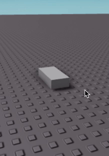

`BodyForce` in Roblox will apply a force to a part with the magnitude and velocity specified in world coordinates. By setting `workspace.Gravity` to 0, we can explore what a force applied to an object does. Firstly, if we apply a force of 5 studs in the y direction (`Vector3.new(0, 5, 0)`) we can see the part begins to accelerate at a constant velocity:
    

         
Using Newton's 2nd law, we know that the acceleration should be equal to force / mass. Since the mass of the part is 5.6 studs, the acceleration should be around 0.892 studs per second.

If I add an opposing force of `Vector3.new(0, -5, 0)` we can see that the object doesn't accelerate, as the net forces are `0, 0, 0`:

$$
\begin{bmatrix} 0 \\ 5 \\ 0 \end{bmatrix} + \begin{bmatrix} 0 \\ -5 \\ 0 \end{bmatrix} = \begin{bmatrix} 0 + 0 \\ 5 + (-5) \\ 0 + 0 \end{bmatrix} = \begin{bmatrix} 0 \\ 0 \\ 0 \end{bmatrix}
$$

Related to [[Newtons Laws Of Motion]] and [[Vector Addition & Subtraction]]

#### References

[BodyMovers](https://developer.roblox.com/en-us/articles/BodyMover) (Roblox.com)