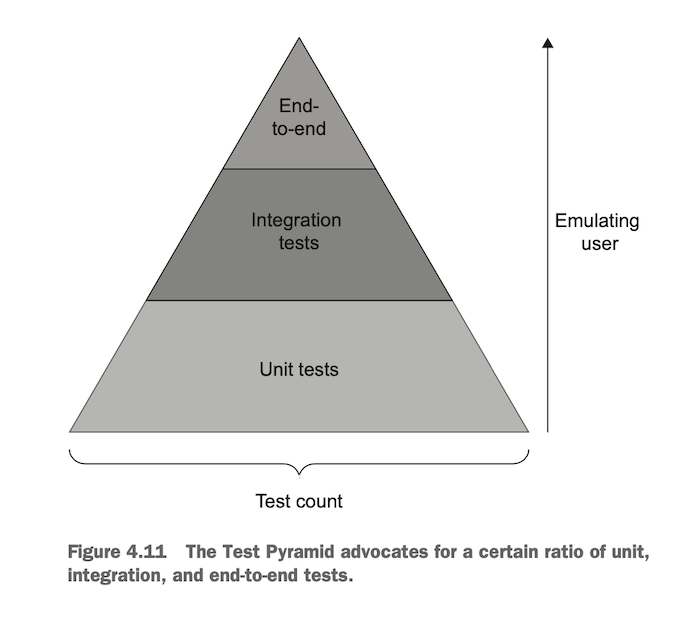

The Test Pyramid advocates for a balance of automated tests where unit tests are most prevalent, followed by integration tests then end-to-end tests. Khorikov introduces a varient on the common diagram where the height refers to closeness to "emulating the end user's behaviour":

The Test Pyramid is a little misleading in that people interpret as unit tests are better, e2e tests are worse. But they are only better in the sense that they are faster and less prone to noise and false positives.

If one could construct e2e tests that were as fast as unit tests and were easy to maintain, which is sometimes the case in API development, then the suite should consist entirely of them. They provide good resistance to refactoring and good protection against regressions (see [[4 Pillars of Good Unit Tests]]) at the cost of fast feedback.

Khorikov also provide an exception with respect to CRUD style apps and others that have little "algorithmic or business complexity". They are usually better served by more integration tests than unit tests. The Django framework serves as a good example of this: their default testing method is done via integrations with a real database.

References:

* [[Unit Testing Principles, Practices and Patterns]] (4. The four pillars of a good unit test)
* [TestPyramid](https://martinfowler.com/bliki/TestPyramid.html)